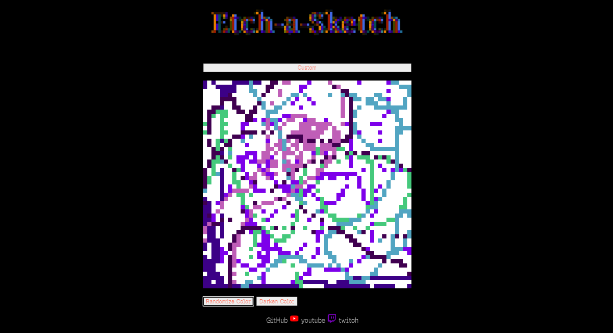

# Etch-a-sketch

A browser-based **Etch-a-Sketch** drawing application built with **HTML, CSS, and JavaScript**. Draw by hovering over the grid, customize its size, and recreate the experience of the classic Etch-a-Sketch toy.

## Live Demo

**Website:** https://mayn18.github.io/Etch-a-sketch/


## Features

* Draw by hovering over grid cells
* Adjustable grid size
* Clear and reset the drawing board
* Responsive, interactive interface
* Built with vanilla JavaScript

---

## Built With

* HTML5
* CSS3
* JavaScript (ES6)

---

## Preview

Add a screenshot of your project here.

```md

```

---

## What I Learned

This project helped me strengthen my understanding of:

* DOM manipulation
* Event handling
* Dynamic element creation
* CSS Grid and Flexbox
* JavaScript functions and loops
* Writing cleaner, modular code

---

## The Odin Project

This project was completed as part of **The Odin Project Foundations Curriculum**. The objective was to build an interactive Etch-a-Sketch application using JavaScript and DOM manipulation while reinforcing core front-end development concepts.

Learn more about The Odin Project:

https://www.theodinproject.com/

---

## Running Locally

Clone the repository:

```bash
git clone https://github.com/Mayn18/Etch-a-sketch.git
```

Navigate into the project directory:

```bash
cd Etch-a-sketch
```

Open `index.html` in your preferred browser.

---

## Contributing

Contributions, suggestions, and improvements are welcome. Feel free to fork the repository and open a pull request.

---

## License

This project is open source and available under the MIT License.
